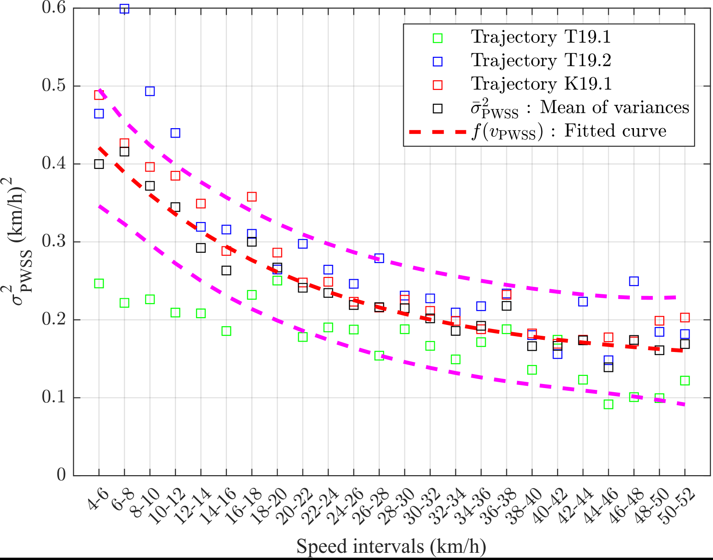
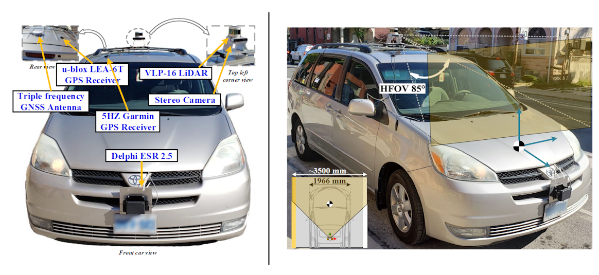
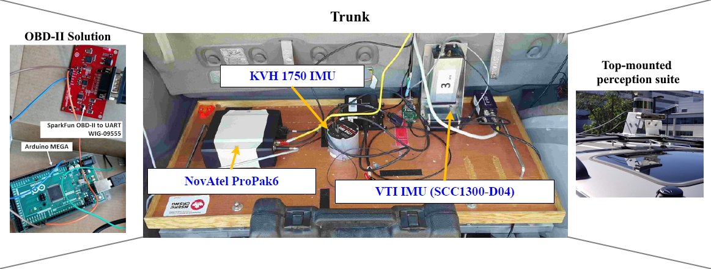

# Automotive Speed Estimation: Sensor Types and Error Characteristics from OBD-II to ADAS

This repository accompanies the IEEE conference paper **"Automotive Speed Estimation: Sensor Types and Error Characteristics from OBD-II to ADAS"**, to be presented at **IEEE/ION PLANS 2025**. A preprint is available on [arXiv](https://arxiv.org/abs/XXXX.XXXXX).

---

## Overview

This repository provides supplementary material for the paper, including images, code, and datasets demonstrating the results discussed in the publication. Below are the visualizations of the road test trajectories referenced in the paper, located in the `/imgs` folder.

---

## Images and Captions

### <ins>Section 1: Road Test Trajectories</ins>

### Figure 1: Toronto T19.1

### Figure 2: Toronto T19.2

### Figure 3: Kingston K19.1

### <ins>Section 2: Error Analysis</ins>

*Error variance analysis on OBD-II-derived vehicular speed data gathered throughout the 3 different trajectories.*

### <ins>Section 3: Field Test Setup</ins>
  
  


<p align="center">
  *Snapshots of the vehicle testbed equipped with sensors, along with the OBD-II to UART interfacing module, all utilized for data collection and validation.*
</p>
---

## Citation

If you find this work useful, please cite:

```
@inproceedings{Ragab2025,
  title={Automotive Speed Estimation: Sensor Types and Error Characteristics from OBD-II to ADAS},
  author={Hany Ragab et al.},
  booktitle={IEEE/ION PLANS},
  year={2025},
  note={Preprint available at https://arxiv.org/abs/XXXX.XXXXX}
}
```

## Acknowledgments

1. We would like to express our sincere gratitude to Dr. M. Karaim for generously providing his minivan for the road test experiments.  
2. Special thanks to Mr. M. Adam for his invaluable assistance in building the mounts used in the experiments.  
3. Data collection was carried out collaboratively by Dr. M. Karaim, Ms. S. K. Abdelaziz, Mr. M. Rashed, Mr. A. Aboutaleb, and Dr. H. Ragab. [View team photo](https://photos.app.goo.gl/VjGzmWq3mvUCKFh67).

This research activity was funded by the Natural Sciences and Engineering Research Council of Canada (NSERC) through a Discovery Grant, with additional support from DND and Mitacs through the Mitacs Accelerate program (IT number: IT12699), all under the supervision of Dr. A. Noureldin.

---

## License

This project is licensed under the MIT License. See the `LICENSE` file for details.

---
