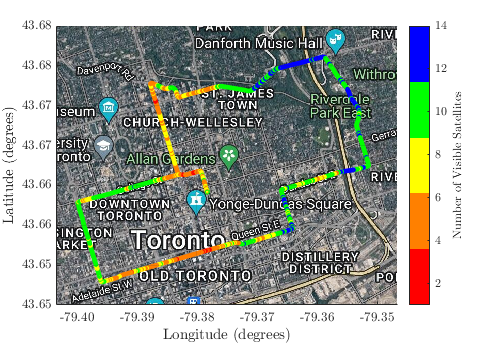
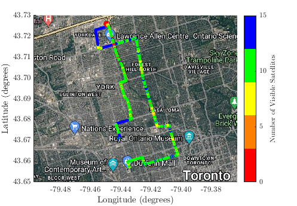
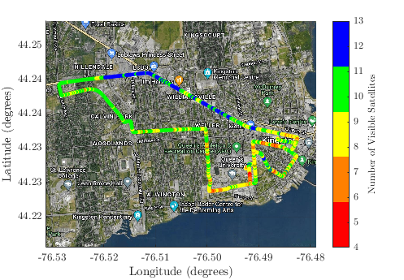
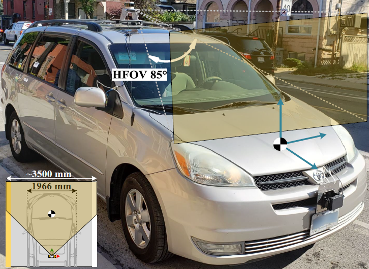

# Automotive Speed Estimation: Sensor Types and Error Characteristics from OBD-II to ADAS

This repository accompanies the IEEE conference paper **"Automotive Speed Estimation: Sensor Types and Error Characteristics from OBD-II to ADAS"**, to be presented at **IEEE/ION PLANS 2025**. A preprint is available on [arXiv](https://arxiv.org/abs/XXXX.XXXXX).

---

## Overview

This repository provides supplementary material for the paper, including images, code, and datasets that demonstrate the results discussed in the publication. Below are the visualizations of the road test trajectories referenced in the paper, located in the `/imgs` folder.

---

## Images and Captions

### <ins>Section 1: Road Test Trajectories</ins>

### Figure 1: Toronto T19.1

### Figure 2: Toronto T19.2

### Figure 3: Kingston K19.1

### <ins>Section 2: Error Analysis</ins>
  
*Error variance analysis on OBD-II-derived vehicular speed data gathered throughout the 3 different trajectories.*

<p align="center">
### <ins>Section 3: Field Test Setup</ins>
  
  
</p>
*A snapshot of the vehicle testbed equipped with sensors used for data collection and validation.*

---

## Citation

If you find this work useful, please cite:

```
@inproceedings{Ragab2025,
  title={Automotive Speed Estimation: Sensor Types and Error Characteristics from OBD-II to ADAS},
  author={Hany Ragab et al.},
  booktitle={IEEE/ION PLANS},
  year={2025},
  note={Preprint available at https://arxiv.org/abs/XXXX.XXXXX}
}
```

---

## License

This project is licensed under the MIT License. See the `LICENSE` file for details.

---
